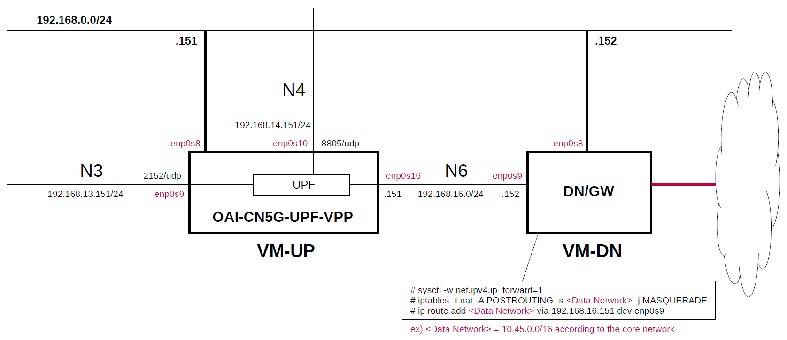

# Install VPP-UPF with DPDK on Host
This briefly describes the steps and configuration to build and install [oai-cn5g-upf-vpp](https://gitlab.eurecom.fr/oai/cn5g/oai-cn5g-upf-vpp) based on [travelping/upg-vpp](https://github.com/travelping/upg-vpp).
**It is intended to be prepared for use with [Open5GS](https://github.com/open5gs/open5gs) and [free5GC](https://github.com/free5gc/free5gc).**

---

<a id="toc"></a>

## Table of Contents

- [Simple Overview of VPP-UPF and Data Network Gateway](#overview)
- [Build OAI UPF (VPP-UPF) on VM-UP](#build)
  - [Clone OAI UPF (VPP-UPF)](#clone)
  - [Change to build all VPP plugins](#change)
  - [Edit oai-cn5g-upf-vpp/build/scripts/build_helper.upf](#edit)
  - [Install VPP-UPF software dependencies](#depend)
  - [Build VPP-UPF](#build_1)
- [Setup VPP-UPF with DPDK on VM-UP](#setup_up)
  - [Install dpdk-devbind.py](#install_dpdk)
  - [Load kernel module "uio_pci_generic"](#load_module)
  - [Check Interfaces](#check_interfaces)
  - [Bind enp0s9/enp0s10/enp0s16 interfaces to DPDK compatible driver (e.g. uio_pci_generic here)](#bind_interfaces)
  - [Verify DPDK binding](#verify_binding)
  - [Create configuration files](#conf)
- [Run VPP-UPF with DPDK on VM-UP](#run)
  - [Verify interfaces at VPP](#verify)
- [Setup Data Network Gateway on VM-DN](#setup_dn)
- [Sample Configurations](#sample_conf)
  - [For 5G](#5g_conf)
  - [For 4G](#4g_conf)
- [Annex 1. Build and Configure UPG-VPP v1.10.0 on VM-UP](#annex_1)
  - [Install required packages](#install_packages)
  - [Build VPP v22.10 applied with patches of FPP-VPP v22.10.10](#build_vpp)
  - [Build UPG-VPP v1.10.0](#build_upg_vpp)
  - [Changes in configuration files of UPG-VPP](#changes_up)
  - [Run UPG-VPP with DPDK](#run_upg_vpp)
- [Changelog (summary)](#changelog)

---

<a id="overview"></a>

## Simple Overview of VPP-UPF and Data Network Gateway

This describes a simple configuration of VPP-UPF and Data Network Gateway, focusing on U-Plane.
**Note that this configuration is implemented with Virtualbox VMs.**

The following minimum configuration was set as a condition.
- One UPF and Data Network Gateway

The built simulation environment is as follows.

</img>

The VPP-UPF used is as follows.
- VPP-UPF - OpenAir CN 5G for UPF v1.5.1 (2023.05.15) - https://gitlab.eurecom.fr/oai/cn5g/oai-cn5g-upf-vpp

Each VMs are as follows.  
| VM | SW & Role | IP address | OS | CPU<br>(Min) | Memory<br>(Min) | HDD<br>(Min) |
| --- | --- | --- | --- | --- | --- | --- |
| VM-UP | OpenAir CN 5G for UPF | 192.168.0.151/24 | Ubuntu 22.04 | 2 | 8GB | 20GB |
| VM-DN | Data Network Gateway  | 192.168.0.152/24 | Ubuntu 22.04 | 1 | 1GB | 10GB |

The network interfaces of each VM are as follows.
**Note. Do not enable(up) any devices that will be under the control of DPDK.
These devices will be enabled and set IP addresses in the `init.conf` file of VPP-UPF.**
| VM | Device | Network Adapter | IP address | Interface | Under DPDK |
| --- | --- | --- | --- | --- | --- |
| VM-UP | enp0s3 | NAT(default) | 10.0.2.15/24 | (VM default NW) | -- |
| | enp0s8 | Bridged Adapter | 192.168.0.151/24 | (Mgmt NW) | -- |
| | enp0s9 | NAT Network | 192.168.13.151/24 | N3 | x |
| | enp0s10 | NAT Network | 192.168.14.151/24 | N4 | x |
| | enp0s16 | NAT Network | 192.168.16.151/24 | N6 | x |
| VM-DN | enp0s3 | NAT(default) | 10.0.2.15/24 | (VM default NW) | -- |
| | enp0s8 | Bridged Adapter | 192.168.0.152/24 | (Mgmt NW) | -- |
| | enp0s9 | NAT Network | 192.168.16.152/24 | N6 | -- |

NAT networks of Virtualbox  are as follows.
| Network Name | Network CIDR |
| --- | --- |
| N3 | 192.168.13.0/24 |
| N4 | 192.168.14.0/24 |
| N6 | 192.168.16.0/24 |

**Note. Virtualbox GUI tool can only register up to 4 Network Adapters in one VM.
Since 5 Network Adapters are registered in VM-UP, one cannot be registered with the GUI tool.
In this case, directly edit the vbox file as follows and register the remaining Network Adapter.**

**For example)**
```diff
--- upf-vpp-dpdk-10.vbox.orig   2023-06-12 20:53:32.344961102 +0900
+++ upf-vpp-dpdk-10.vbox        2023-06-13 21:57:19.777484821 +0900
@@ -68,7 +68,12 @@
           </DisabledModes>
           <NATNetwork name="N4"/>
         </Adapter>
-        <Adapter slot="8" MACAddress="0800272F0298" cable="false"/>
+        <Adapter slot="8" enabled="true" MACAddress="0800272F0298" type="82540EM">
+          <DisabledModes>
+            <InternalNetwork name="intnet"/>
+          </DisabledModes>
+          <NATNetwork name="N6"/>
+        </Adapter>
         <Adapter slot="9" MACAddress="080027A0C784" cable="false"/>
         <Adapter slot="10" MACAddress="080027C6438A" cable="false"/>
         <Adapter slot="11" MACAddress="080027594595" cable="false"/>
```

Set network instance to `internet`.
| Network Instance |
| --- |
| internet |

<a id="build"></a>

## Build OAI UPF (VPP-UPF) on VM-UP

Please refer to the following for building OAI UPF (VPP-UPF).
- VPP-UPF - OpenAir CN 5G for UPF v1.5.1 (2023.05.15) - https://gitlab.eurecom.fr/oai/cn5g/oai-cn5g-upf-vpp/-/blob/master/docs/INSTALL_ON_HOST.md

<a id="clone"></a>

### Clone OAI UPF (VPP-UPF)

```
# git clone https://gitlab.eurecom.fr/oai/cn5g/oai-cn5g-upf-vpp.git
# cd oai-cn5g-upf-vpp
# git checkout develop
```

<a id="change"></a>

### Change to build all VPP plugins

Rename the patch file so as not to apply the patch for building only `dpdk` and `upf` plugins.

```
# cd oai-cn5g-upf-vpp/scripts/patches
# mv build_selected_plugins.patch build_selected_plugins.patch_not_use
```

<a id="edit"></a>

### Edit oai-cn5g-upf-vpp/build/scripts/build_helper.upf

```diff
--- build_helper.upf.orig       2023-07-09 08:19:54.945596895 +0900
+++ build_helper.upf    2023-07-09 09:55:03.435811764 +0900
@@ -122,11 +122,11 @@
 
 add_Travelping_upf_plugin(){
   GIT_URL=https://github.com/travelping/upg-vpp.git
-  GIT_BRANCH=master
+  GIT_BRANCH=stable/1.2
   echo_info "Cloning Travelping UPG plugin"
   pushd $OPENAIRCN_DIR/
   git clone -b $GIT_BRANCH $GIT_URL
-  cd $OPENAIRCN_DIR/upg-vpp && git checkout -f 1f047425c5c99db44c2e599ad1dfd767d426cce8
+  cd $OPENAIRCN_DIR/upg-vpp
   mkdir -p -- $OPENAIRCN_DIR/vpp/patches
   cp -rf $OPENAIRCN_DIR/upg-vpp/upf/ $OPENAIRCN_DIR/vpp/src/plugins/
   cp -rf $OPENAIRCN_DIR/upg-vpp/vpp-patches/* $OPENAIRCN_DIR/vpp/patches
@@ -153,9 +153,7 @@
   $SUDO cp -rf $OPENAIRCN_DIR/vpp/build-root/install-vpp-native/vpp/bin/vppctl /bin/
   echo_info "Copied binaries to /bin"
   # Copying necessary libraries
-#  $SUDO cp -rf $OPENAIRCN_DIR/vpp/build-root/install-vpp-native/vpp/lib/vpp_plugins /usr/lib/x86_64-linux-gnu/vpp_plugins/
-  $SUDO cp -rf $OPENAIRCN_DIR/vpp/build-root/install-vpp-native/vpp/lib/vpp_plugins/upf_plugin.so /usr/lib/x86_64-linux-gnu/vpp_plugins/
-  $SUDO cp -rf $OPENAIRCN_DIR/vpp/build-root/install-vpp-native/vpp/lib/vpp_plugins/dpdk_plugin.so /usr/lib/x86_64-linux-gnu/vpp_plugins/
+  $SUDO cp -rf $OPENAIRCN_DIR/vpp/build-root/install-vpp-native/vpp/lib/vpp_plugins /usr/lib/x86_64-linux-gnu/vpp_plugins/
   $SUDO cp -rf $OPENAIRCN_DIR/vpp/build-root/install-vpp-native/vpp/lib/libvppinfra.so.21.01.1 /usr/lib/x86_64-linux-gnu/
   $SUDO cp -rf $OPENAIRCN_DIR/vpp/build-root/install-vpp-native/vpp/lib/libvnet.so.21.01.1 /usr/lib/x86_64-linux-gnu/
   $SUDO cp -rf $OPENAIRCN_DIR/vpp/build-root/install-vpp-native/vpp/lib/libvlibmemory.so.21.01.1 /usr/lib/x86_64-linux-gnu/
```

<a id="depend"></a>

### Install VPP-UPF software dependencies

```
# cd oai-cn5g-upf-vpp/build/scripts
# ./build_vpp_upf -I -f
```

<a id="build_1"></a>

### Build VPP-UPF

```
# cd oai-cn5g-upf-vpp/build/scripts
# ./build_vpp_upf -c -V 
```

<a id="setup_up"></a>

## Setup VPP-UPF with DPDK on VM-UP

Please refer to the following for setup VPP-UPF with DPDK.
- VPP-UPF - OpenAir CN 5G for UPF v1.5.1 (2023.05.15) - https://gitlab.eurecom.fr/oai/cn5g/oai-cn5g-upf-vpp/-/blob/master/docs/VPP_UPG_WITH_DPDK.md

<a id="install_dpdk"></a>

### Install dpdk-devbind.py

```
# wget https://raw.githubusercontent.com/DPDK/dpdk/main/usertools/dpdk-devbind.py -O /usr/local/bin/dpdk-devbind.py
# chmod +x /usr/local/bin/dpdk-devbind.py
```

<a id="load_module"></a>

### Load kernel module "uio_pci_generic"

```
# modprobe uio_pci_generic
```

<a id="check_interfaces"></a>

### Check Interfaces

```
# lshw -c network -businfo
Bus info          Device      Class       Description
=====================================================
pci@0000:00:03.0  enp0s3      network     82540EM Gigabit Ethernet Controller
pci@0000:00:08.0  enp0s8      network     82540EM Gigabit Ethernet Controller
pci@0000:00:09.0  enp0s9      network     82540EM Gigabit Ethernet Controller
pci@0000:00:0a.0  enp0s10     network     82540EM Gigabit Ethernet Controller
pci@0000:00:10.0  enp0s16     network     82540EM Gigabit Ethernet Controller
```

<a id="bind_interfaces"></a>

### Bind enp0s9/enp0s10/enp0s16 interfaces to DPDK compatible driver (e.g. uio_pci_generic here)

```
# dpdk-devbind.py -b uio_pci_generic  0000:00:09.0  --force
# dpdk-devbind.py -b uio_pci_generic  0000:00:0a.0  --force
# dpdk-devbind.py -b uio_pci_generic  0000:00:10.0  --force
```

<a id="verify_binding"></a>

### Verify DPDK binding

```
# lshw -c network -businfo
Bus info          Device      Class       Description
=====================================================
pci@0000:00:03.0  enp0s3      network     82540EM Gigabit Ethernet Controller
pci@0000:00:08.0  enp0s8      network     82540EM Gigabit Ethernet Controller
pci@0000:00:09.0              network     82540EM Gigabit Ethernet Controller
pci@0000:00:0a.0              network     82540EM Gigabit Ethernet Controller
pci@0000:00:10.0              network     82540EM Gigabit Ethernet Controller
```
```
# dpdk-devbind.py -s

Network devices using DPDK-compatible driver
============================================
0000:00:09.0 '82540EM Gigabit Ethernet Controller 100e' drv=uio_pci_generic unused=e1000,vfio-pci
0000:00:0a.0 '82540EM Gigabit Ethernet Controller 100e' drv=uio_pci_generic unused=e1000,vfio-pci
0000:00:10.0 '82540EM Gigabit Ethernet Controller 100e' drv=uio_pci_generic unused=e1000,vfio-pci

Network devices using kernel driver
===================================
0000:00:03.0 '82540EM Gigabit Ethernet Controller 100e' if=enp0s3 drv=e1000 unused=vfio-pci,uio_pci_generic *Active*
0000:00:08.0 '82540EM Gigabit Ethernet Controller 100e' if=enp0s8 drv=e1000 unused=vfio-pci,uio_pci_generic *Active*

No 'Baseband' devices detected
==============================

No 'Crypto' devices detected
============================

No 'DMA' devices detected
=========================

No 'Eventdev' devices detected
==============================

No 'Mempool' devices detected
=============================

No 'Compress' devices detected
==============================

No 'Misc (rawdev)' devices detected
===================================

No 'Regex' devices detected
===========================
```

<a id="conf"></a>

### Create configuration files

Create `/root/openair-upf` directory and put the configuration files there.

- `/root/openair-upf/startup.conf`

```
unix {
  nodaemon
  log /tmp/vpp.log
  full-coredump
  gid vpp
  interactive
  cli-listen /run/vpp/cli.sock
  exec /root/openair-upf/init.conf
}

api-trace {
  on
}

cpu {
  main-core 0
  corelist-workers 1
}

api-segment {
  gid vpp
}

dpdk {
  dev 0000:00:09.0 {name n3}
  dev 0000:00:0a.0 {name n4}
  dev 0000:00:10.0 {name n6}
}

plugins {
    path /usr/lib/x86_64-linux-gnu/vpp_plugins/
    plugin ikev2_plugin.so { disable }
    plugin dpdk_plugin.so { enable }
    plugin upf_plugin.so { enable }
}
```
For example, if you prepare four CPU cores and want to assign CPU core (`#0`) to `main-core` and three CPU cores (`#1-3`) to `corelist-workers`, configure the `startup.conf` file as follows.
```
cpu {
  main-core 0
  corelist-workers 1-3
}
```
As a result, each of the three CPU cores has a usage rate of 100% (300% in total). When displayed using the `top` command, it looks like the following.
```
top - 22:52:57 up 4 min,  4 users,  load average: 2.73, 1.22, 0.47
Tasks: 151 total,   2 running, 149 sleeping,   0 stopped,   0 zombie
%Cpu(s): 75.2 us,  0.2 sy,  0.0 ni, 24.5 id,  0.0 wa,  0.0 hi,  0.0 si,  0.0 st
MiB Mem :   7935.3 total,   6126.9 free,   1170.5 used,    638.0 buff/cache
MiB Swap:      0.0 total,      0.0 free,      0.0 used.   6524.8 avail Mem 

    PID USER      PR  NI    VIRT    RES    SHR S  %CPU  %MEM     TIME+ COMMAND
   1204 root      20   0   82.2g 981656  29860 R 302.0  12.1   5:48.50 vpp_main <--
    102 root      20   0       0      0      0 I   0.3   0.0   0:00.11 kworker/2:1-events
...
```

- `/root/openair-upf/init.conf`

Set network instance to `internet`.
```
set interface ip table n6 0
set interface mtu 9000 n6
set interface ip address n6 192.168.16.151/24
set interface state n6 up

set interface ip table n4 0
set interface mtu 9000 n4
set interface ip address n4 192.168.14.151/24
set interface state n4 up

set interface ip table n3 0
set interface mtu 9000 n3
set interface ip address n3 192.168.13.151/24
set interface state n3 up

ip route add 0.0.0.0/0 table 0 via 192.168.16.152 n6

upf pfcp endpoint ip 192.168.14.151 vrf 0

upf node-id fqdn 192.168.14.151

upf nwi name internet vrf 0

upf specification release 16

upf gtpu endpoint ip 192.168.13.151 nwi internet teid 0x000004d2/2
```
By adding the following line as in `init.conf` above,
```
upf specification release 16
```
`FTUP: Supported` is set in `UP Function Features` of `PFCP Association Setup Response` from VPP-UPF.

<a id="run"></a>

## Run VPP-UPF with DPDK on VM-UP

```
# /usr/bin/vpp -c /root/openair-upf/startup.conf
dpdk             [warn  ]: not enough DPDK crypto resources
dpdk/cryptodev   [warn  ]: dpdk_cryptodev_init: Not enough cryptodevs
    _______    _        _   _____  ___ 
 __/ __/ _ \  (_)__    | | / / _ \/ _ \
 _/ _// // / / / _ \   | |/ / ___/ ___/
 /_/ /____(_)_/\___/   |___/_/  /_/    

vpp# 
```

<a id="verify"></a>

### Verify interfaces at VPP

```
vpp# show hardware-interfaces 
              Name                Idx   Link  Hardware
local0                             0    down  local0
  Link speed: unknown
  local
0: format_dpdk_device:590: rte_eth_dev_rss_hash_conf_get returned -95
n3                                 1     up   n3
  Link speed: 1 Gbps
  Ethernet address 08:00:27:bd:c2:88
  Intel 82540EM (e1000)
    carrier up full duplex mtu 9000 
    flags: admin-up pmd maybe-multiseg tx-offload intel-phdr-cksum rx-ip4-cksum
    Devargs: 
    rx: queues 1 (max 1), desc 1024 (min 32 max 4096 align 8)
    tx: queues 1 (max 1), desc 1024 (min 32 max 4096 align 8)
    pci: device 8086:100e subsystem 8086:001e address 0000:00:09.00 numa 0
    max rx packet len: 16128
    promiscuous: unicast off all-multicast on
    vlan offload: strip off filter off qinq off
    rx offload avail:  vlan-strip ipv4-cksum udp-cksum tcp-cksum vlan-filter 
                       jumbo-frame scatter keep-crc 
    rx offload active: ipv4-cksum jumbo-frame scatter 
    tx offload avail:  vlan-insert ipv4-cksum udp-cksum tcp-cksum multi-segs 
    tx offload active: udp-cksum tcp-cksum multi-segs 
    rss avail:         none
    rss active:        none
    tx burst function: eth_em_xmit_pkts
    rx burst function: eth_em_recv_scattered_pkts
0: format_dpdk_device:590: rte_eth_dev_rss_hash_conf_get returned -95

n4                                 2     up   n4
  Link speed: 1 Gbps
  Ethernet address 08:00:27:37:37:0c
  Intel 82540EM (e1000)
    carrier up full duplex mtu 9000 
    flags: admin-up pmd maybe-multiseg tx-offload intel-phdr-cksum rx-ip4-cksum
    Devargs: 
    rx: queues 1 (max 1), desc 1024 (min 32 max 4096 align 8)
    tx: queues 1 (max 1), desc 1024 (min 32 max 4096 align 8)
    pci: device 8086:100e subsystem 8086:001e address 0000:00:0a.00 numa 0
    max rx packet len: 16128
    promiscuous: unicast off all-multicast on
    vlan offload: strip off filter off qinq off
    rx offload avail:  vlan-strip ipv4-cksum udp-cksum tcp-cksum vlan-filter 
                       jumbo-frame scatter keep-crc 
    rx offload active: ipv4-cksum jumbo-frame scatter 
    tx offload avail:  vlan-insert ipv4-cksum udp-cksum tcp-cksum multi-segs 
    tx offload active: udp-cksum tcp-cksum multi-segs 
    rss avail:         none
    rss active:        none
    tx burst function: eth_em_xmit_pkts
    rx burst function: eth_em_recv_scattered_pkts

n6                                 3     up   n6
  Link speed: 1 Gbps
  Ethernet address 08:00:27:2f:02:98
  Intel 82540EM (e1000)
    carrier up full duplex mtu 9000 
    flags: admin-up pmd maybe-multiseg tx-offload intel-phdr-cksum rx-ip4-cksum
    Devargs: 
    rx: queues 1 (max 1), desc 1024 (min 32 max 4096 align 8)
    tx: queues 1 (max 1), desc 1024 (min 32 max 4096 align 8)
    pci: device 8086:100e subsystem 8086:001e address 0000:00:10.00 numa 0
    max rx packet len: 16128
    promiscuous: unicast off all-multicast on
    vlan offload: strip off filter off qinq off
    rx offload avail:  vlan-strip ipv4-cksum udp-cksum tcp-cksum vlan-filter 
                       jumbo-frame scatter keep-crc 
    rx offload active: ipv4-cksum jumbo-frame scatter 
    tx offload avail:  vlan-insert ipv4-cksum udp-cksum tcp-cksum multi-segs 
    tx offload active: udp-cksum tcp-cksum multi-segs 
    rss avail:         none
    rss active:        none
    tx burst function: eth_em_xmit_pkts
    rx burst function: eth_em_recv_scattered_pkts

upf-nwi-internet                   4     up   upf-nwi-internet
  Link speed: unknown
  GTPU
vpp# 
```

```
vpp# show interface address
local0 (dn):
n3 (up):
  L3 192.168.13.151/24
n4 (up):
  L3 192.168.14.151/24
n6 (up):
  L3 192.168.16.151/24
upf-nwi-internet (up):
vpp# 
```

```
vpp# show udp punt
IPV4 UDP ports punt : 2152, 8805
IPV6 UDP ports punt : 2152
vpp# 
```

<a id="setup_dn"></a>

## Setup Data Network Gateway on VM-DN

First, uncomment the next line in the `/etc/sysctl.conf` file and reflect it in the OS.
```
net.ipv4.ip_forward=1
```
```
# sysctl -p
```
Next, configure NAPT and routing to N6 IP address of VPP-UPF.
```
# iptables -t nat -A POSTROUTING -s <DN> -j MASQUERADE
# ip route add <DN> via 192.168.16.151 dev enp0s9
```
**Note. Set `<DN>` according to the core network.  
ex) `10.45.0.0/16`**

---
With the above steps, the VPP-UPF environment with DPDK has been constructed.
You will be able to work VPP-UPF with Open5GS and free5GC.
I would like to thank the excellent developers and all the contributors of OpenAir CN 5G for UPF, UPG-VPP and DPDK.

<a id="sample_conf"></a>

## Sample Configurations

<a id="5g_conf"></a>

### For 5G

- [Open5GS 5GC & UERANSIM UE / RAN Sample Configuration - VPP-UPF with DPDK](https://github.com/s5uishida/open5gs_5gc_ueransim_vpp_upf_dpdk_sample_config)
- [free5GC 5GC & UERANSIM UE / RAN Sample Configuration - VPP-UPF with DPDK](https://github.com/s5uishida/free5gc_ueransim_vpp_upf_dpdk_sample_config)

<a id="4g_conf"></a>

### For 4G

- [Open5GS EPC & srsRAN 4G with ZeroMQ UE / RAN Sample Configuration - VPP-UPF(PGW-U) with DPDK](https://github.com/s5uishida/open5gs_epc_srsran_vpp_upf_dpdk_sample_config)

<a id="annex_1"></a>

## Annex 1. Build and Configure UPG-VPP v1.10.0 on VM-UP

The steps to build [travelingping/upg-vpp](https://github.com/travelping/upg-vpp) v1.10.0 on the host are as follows.

**FPP-VPP information required to build UPG-VPP v1.10.0**  
- https://github.com/travelping/upg-vpp/blob/v1.10.0/vpp.spec

**VPP and OS information required to build FPP-VPP v22.10.10**  
- https://github.com/travelping/fpp-vpp/blob/v22.10.10/vpp.spec
- https://github.com/travelping/fpp-vpp/blob/v22.10.10/Dockerfile

VM-UP is as follows.

| VM | SW & Role | IP address | OS | CPU<br>(Min) | Memory<br>(Min) | HDD<br>(Min) |
| --- | --- | --- | --- | --- | --- | --- |
| VM-UP | UPG-VPP U-Plane | 192.168.0.151/24 | Ubuntu **20.04** | 2 | 8GB | 20GB |

<a id="install_packages"></a>

### Install required packages

```
# apt install build-essential git meson ninja-build libhyperscan-dev
```

<a id="build_vpp"></a>

### Build VPP v22.10 applied with patches of FPP-VPP v22.10.10

```
# cd ~
# git clone https://github.com/travelping/fpp-vpp.git
# cd fpp-vpp
# git checkout refs/tags/v22.10.10
```
```
# cd ~
# git clone https://github.com/FDio/vpp.git
# cd vpp
# git checkout stable/2210
# git reset --hard 07e0c05e698cf5ffd1e2d2de0296d1907519dc3d
# git am ../fpp-vpp/vpp-patches/*.patch
# make install-dep
# make install-ext-deps
# make build-release
```
If you want to build in debug mode, make as follows.
```
# make build
```

<a id="build_upg_vpp"></a>

### Build UPG-VPP v1.10.0

```
# cd ~
# git clone https://github.com/travelping/upg-vpp.git
# cd upg-vpp
# git checkout refs/tags/v1.10.0
# make version
# mkdir build
# cd build
# cmake -DVPP_HOME=/root/vpp/build-root/install-vpp-native/vpp ..
# make
# cp upf_plugin.so /root/vpp/build-root/install-vpp-native/vpp/lib/x86_64-linux-gnu/vpp_plugins
```
Now the UPG-VPP was built in `/root/vpp/build-root/install-vpp-native/vpp`.

If you built VPP in debug mode, do the following:
```
...
# cmake -DVPP_HOME=/root/vpp/build-root/install-vpp_debug-native/vpp ..
# make
# cp upf_plugin.so /root/vpp/build-root/install-vpp_debug-native/vpp/lib/x86_64-linux-gnu/vpp_plugins
```

<a id="changes_up"></a>

### Changes in configuration files of UPG-VPP

See [here](#conf) for the original files.

- `openair-upf/startup.conf`  

```diff
--- startup.conf.orig   2023-07-09 11:59:18.000000000 +0900
+++ startup.conf        2023-11-09 00:01:46.830150314 +0900
@@ -1,3 +1,5 @@
+heapsize 2G
+
 unix {
   nodaemon
   log /tmp/vpp.log
@@ -28,8 +30,8 @@
 }
 
 plugins {
-    path  /usr/lib/x86_64-linux-gnu/vpp_plugins/
-    plugin ikev2_plugin.so { disable }
+    path  /root/vpp/build-root/install-vpp-native/vpp/lib/x86_64-linux-gnu/vpp_plugins/
+    plugin oddbuf_plugin.so { enable }
     plugin dpdk_plugin.so { enable }
     plugin upf_plugin.so { enable }
 }
```

- `openair-upf/init.conf`  
There is no change.

<a id="run_upg_vpp"></a>

### Run UPG-VPP with DPDK

First, create group `vpp` if it doesn't exist.
```
# addgroup vpp
```
Then run UPG-VPP with DPDK.
```
# /root/vpp/build-root/install-vpp-native/vpp/bin/vpp -c /root/openair-upf/startup.conf
/root/vpp/build-root/install-vpp-native/vpp/bin/vpp: Relink `/lib/x86_64-linux-gnu/libhs_runtime.so.5' with `/lib/x86_64-linux-gnu/libhs.so.5' for IFUNC symbol `dbIsValid'
perfmon              [warn  ]: skipping source 'intel-uncore' - intel_uncore_init: no uncore units found
    _______    _        _   _____  ___ 
 __/ __/ _ \  (_)__    | | / / _ \/ _ \
 _/ _// // / / / _ \   | |/ / ___/ ___/
 /_/ /____(_)_/\___/   |___/_/  /_/    

vpp# 
```

<a id="changelog"></a>

## Changelog (summary)

- [2023.11.08] Added build instructions for UPG-VPP v1.10.0 on Host.
- [2023.09.13] Added sample configurations.
- [2023.07.09] Changed to build all VPP plugins.
- [2023.07.05] When installing on host, changed to use the `stable/1.2` branch of `travelping/upg-vpp` described in `oai-cn5g-upf-vpp/docker/Dockerfile.*`.
- [2023.06.18] Added `upf specification release 16` line in `init.conf`. Along with this, the corresponding description was deleted because the correspondence in the case of Open5GS became unnecessary.
- [2023.06.15] Initial release.
