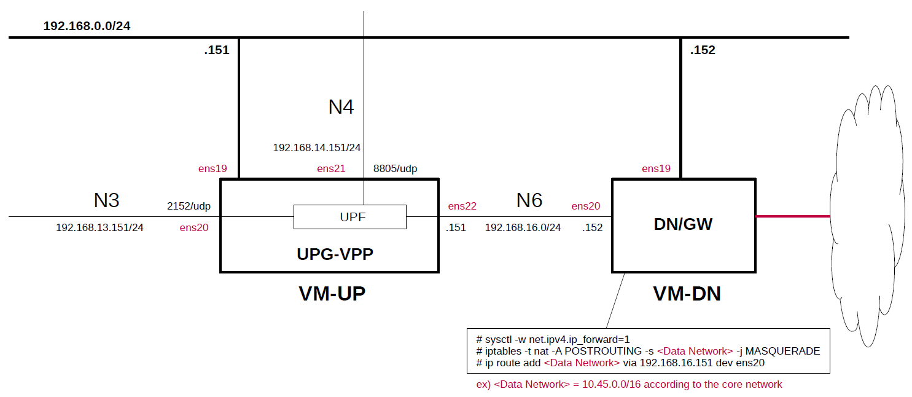

# Install UPG-VPP(DPDK/VPP UPF) on Host
This briefly describes the steps and configuration to build and install [travelping/upg-vpp](https://github.com/travelping/upg-vpp).
**It is intended to be prepared for use with [Open5GS](https://github.com/open5gs/open5gs) and [free5GC](https://github.com/free5gc/free5gc).**

---

### [Sample Configurations and Miscellaneous for Mobile Network](https://github.com/s5uishida/sample_config_misc_for_mobile_network)

---

<a id="toc"></a>

## Table of Contents

- [Simple Overview of UPG-VPP and Data Network Gateway](#overview)
- [Build UPG-VPP on VM-UP](#build)
  - [Confirmed Version List](#ver_list)
  - [Install required packages](#install_pkg)
  - [Build VPP v22.10 applied with patches of FPP-VPP v22.10.13](#build_vpp)
    - [Build binaries for debugging](#build_vpp_debug)
    - [Install the built VPP packages](#install_vpp_pkg)
  - [Build UPG-VPP v1.13.0](#build_upg_vpp)
    - [Install the built UPG-VPP packages](#install_upg_vpp_pkg)
    - [QFI support in PDU Session Container](#pdu_session_container_qfi)
- [Setup UPG-VPP on VM-UP](#setup_up)
  - [Install dpdk-devbind.py](#install_dpdk)
  - [Case of using kernel module "uio_pci_generic"](#uio_pci_generic)
    - [Load kernel module "uio_pci_generic"](#load_module)
    - [Check Interfaces](#check_interfaces)
    - [Bind ens20/ens21/ens22 interfaces to DPDK compatible driver (e.g. uio_pci_generic here)](#bind_interfaces)
    - [Verify DPDK binding](#verify_binding)
  - [Case of using kernel module "vfio-pci"](#vfio_pci)
  - [Network settings](#network_settings)
  - [Create configuration files](#conf)
- [Run UPG-VPP on VM-UP](#run)
  - [Run UPG-VPP when installing the built packages](#run_pkg)
  - [Verify interfaces at VPP](#verify)
- [Setup Data Network Gateway on VM-DN](#setup_dn)
- [How to capture packets on DPDK ports](#pcap)
- [Sample Configurations](#sample_conf)
  - [For 5G](#5g_conf)
  - [For 4G](#4g_conf)
- [Changelog (summary)](#changelog)

---

<a id="overview"></a>

## Simple Overview of UPG-VPP and Data Network Gateway

This describes a simple configuration of UPG-VPP and Data Network Gateway, focusing on U-Plane.
**Note that this configuration is implemented with Proxmox VE VMs.**

The following minimum configuration was set as a condition.
- One UPF and Data Network Gateway

The built simulation environment is as follows.

</img>

The DPDK/VPP UPF used is as follows.
- DPDK/VPP UPF - UPG-VPP v1.13.0 (2024.03.25) - https://github.com/travelping/upg-vpp

Each VMs are as follows.  
| VM | SW & Role | IP address | OS | CPU<br>(Min) | Mem<br>(Min) | HDD<br>(Min) |
| --- | --- | --- | --- | --- | --- | --- |
| VM-UP | UPG-VPP U-Plane | 192.168.0.151/24 | Ubuntu 22.04 | 2 | 8GB | 20GB |
| VM-DN | Data Network Gateway  | 192.168.0.152/24 | Ubuntu 24.04 | 1 | 1GB | 10GB |

The network interfaces of each VM are as follows.
**Note. Do not enable(up) any devices that will be under the control of DPDK.
These devices will be enabled and set IP addresses in the `init.conf` file of UPG-VPP.**
| VM | Device | Model | Linux Bridge | IP address | Interface | Under DPDK |
| --- | --- | --- | --- | --- | --- | --- |
| VM-UP | ~~ens18~~ | ~~VirtIO~~ | ~~vmbr1~~ | ~~10.0.0.151/24~~ | ~~(NAPT NW)~~ ***down*** | -- |
| | ens19 | VirtIO | mgbr0 | 192.168.0.151/24 | (Mgmt NW) | -- |
| | ens20 | VirtIO | vmbr3 | 192.168.13.151/24 | N3 | x |
| | ens21 | VirtIO | vmbr4 | 192.168.14.151/24 | N4 | x |
| | ens22 | VirtIO | vmbr6 | 192.168.16.151/24 | N6 | x |
| VM-DN | ens18 | VirtIO | vmbr1 | 10.0.0.152/24 | (NAPT NW) | -- |
| | ens19 | VirtIO | mgbr0 | 192.168.0.152/24 | (Mgmt NW) | -- |
| | ens20 | VirtIO | vmbr6 | 192.168.16.152/24 | N6 | -- |

Linux Bridges of Proxmox VE are as follows.
| Linux Bridge | Network CIDR | Interface |
| --- | --- | --- |
| vmbr1 | 10.0.0.0/24 | NAPT NW |
| mgbr0 | 192.168.0.0/24 | Mgmt NW |
| vmbr3 | 192.168.13.0/24 | N3 |
| vmbr4 | 192.168.14.0/24 | N4 |
| vmbr6 | 192.168.16.0/24 | N6 |

Set network instance to `internet`.
| Network Instance |
| --- |
| internet |

<a id="build"></a>

## Build UPG-VPP on VM-UP

<a id="ver_list"></a>

### Confirmed Version List

This build instruction is based on `vpp.spec` of [UPG-VPP](https://github.com/travelping/upg-vpp), and `vpp.spec` and `Dockerfile` of [FPP-VPP](https://github.com/travelping/fpp-vpp).
I simply confirmed the operation of the following versions.

| UPG-VPP | FPP-VPP | VPP |
| --- | --- | --- |
| `tag:v1.13.0` | `tag:v22.10.13` | `branch:stable/2210`<br>`commit:07e0c05e698cf5ffd1e2d2de0296d1907519dc3d` |
| `tag:v1.12.0` | `tag:v22.10.12` | `branch:stable/2210`<br>`commit:07e0c05e698cf5ffd1e2d2de0296d1907519dc3d` |
| `tag:v1.11.0` | `tag:v22.10.11` | `branch:stable/2210`<br>`commit:07e0c05e698cf5ffd1e2d2de0296d1907519dc3d` |

<a id="install_pkg"></a>

### Install required packages

```
# apt install build-essential
```

<a id="build_vpp"></a>

### Build VPP v22.10 applied with patches of FPP-VPP v22.10.13

```
# cd ~
# git clone https://github.com/travelping/fpp-vpp.git
# cd fpp-vpp
# git checkout refs/tags/v22.10.13
```
```
# cd ~
# git clone https://github.com/FDio/vpp.git
# cd vpp
# git checkout stable/2210
# git reset --hard 07e0c05e698cf5ffd1e2d2de0296d1907519dc3d
# git am ../fpp-vpp/vpp-patches/*.patch
# make install-dep
# make install-ext-deps
# make build-release
```
Then build binary packages as follows.
```
# make pkg-deb
...
# cd build-root
# ls -l *.deb
-rw-r--r-- 1 root root   194448 Jan 10 15:42 libvppinfra_22.10.0-33~g612d3915c_amd64.deb
-rw-r--r-- 1 root root   144338 Jan 10 15:42 libvppinfra-dev_22.10.0-33~g612d3915c_amd64.deb
-rw-r--r-- 1 root root    26466 Jan 10 15:42 python3-vpp-api_22.10.0-33~g612d3915c_amd64.deb
-rw-r--r-- 1 root root  5575178 Jan 10 15:42 vpp_22.10.0-33~g612d3915c_amd64.deb
-rw-r--r-- 1 root root 82597716 Jan 10 15:43 vpp-dbg_22.10.0-33~g612d3915c_amd64.deb
-rw-r--r-- 1 root root  1294912 Jan 10 15:43 vpp-dev_22.10.0-33~g612d3915c_amd64.deb
-rw-r--r-- 1 root root  4736308 Jan 10 15:42 vpp-plugin-core_22.10.0-33~g612d3915c_amd64.deb
-rw-r--r-- 1 root root   363586 Jan 10 15:42 vpp-plugin-devtools_22.10.0-33~g612d3915c_amd64.deb
-rw-r--r-- 1 root root  4461496 Jan 10 15:42 vpp-plugin-dpdk_22.10.0-33~g612d3915c_amd64.deb
```

<a id="build_vpp_debug"></a>

#### Build binaries for debugging

If you want to build in debug mode, make as follows.
```
...
# make build
```
Then build binary packages as follows.
```
# make pkg-deb-debug
```

<a id="install_vpp_pkg"></a>

#### Install the built VPP packages

When you want to install the VPP packages on another host, first install the following dependent packages.
```
# apt install libnl-route-3-200
```
Then install the VPP packages.
```
# cd build-root
# dpkg -i *.deb
```
This allows you to operate VPP service using `systemctl`.

<a id="build_upg_vpp"></a>

### Build UPG-VPP v1.13.0

```
# cd ~
# git clone https://github.com/travelping/upg-vpp.git
# cd upg-vpp
# git checkout refs/tags/v1.13.0
# make version
# mkdir build
# cd build
# cmake -DVPP_HOME=/root/vpp/build-root/install-vpp-native/vpp ..
# make
```
Then build binary packages as follows.
```
# make package
...
# ls -l *.deb
-rw-r--r-- 1 root root 2888010 Jan 10 15:54 upf-plugin_1.13.0_amd64.deb
-rw-r--r-- 1 root root   38742 Jan 10 15:54 upf-plugin-dev_1.13.0_amd64.deb
```

<a id="install_upg_vpp_pkg"></a>

#### Install the built UPG-VPP packages

When you want to install the UPG-VPP packages on another host, first install the following dependent packages.
```
# apt install libhyperscan-dev
```
Then install the UPG-VPP packages.
```
# cd build
# dpkg -i *.deb
```

<a id="pdu_session_container_qfi"></a>

#### QFI support in PDU Session Container

UPG-VPP v1.13.0 does not support `PDU Session Container`.
Therefore, some gNodeBs may not accept GTP traffic from UPG-VPP that does not contain `DL PDU SESSION INFORMATION` in the `PDU Session Container`.
In that case, you may try the following patches.

1. [Temporary patch](./patches/gtp_ext_hdr_qfi_1.patch) for UPG-VPP v1.13.0 based on the OAI patch by referring to [here](https://github.com/travelping/upg-vpp/issues/387#issuecomment-1935837642). QFI is fixed to 1.  
   When pinging between UEs, the UL GTP-U packets from UPG-VPP to gNodeB contain `PDU Session Container` with QFI, but the return DL GTP-U packets from UPG-VPP to gNodeB do not contain `PDU Session Container` with QFI.  
2. [Patch by @mitmitmitm](https://github.com/travelping/upg-vpp/issues/387#issuecomment-1938190509). To get this patch as follows.
   
   ```
   # wget https://github.com/travelping/upg-vpp/compare/master...mitmitmitm:upg-vpp:qfi.diff -O mitmitmitm-qfi.patch
   ```
   When pinging between UEs, the GTP-U packets for both UL/DL from UPG-VPP to gNodeB contain `PDU Session Container` with QFI.

In addition, with either UPG-VPP, when pinging between the UE and an external node, the GTP-U packets for both UL/DL from UPG-VPP to gNodeB contain `PDU Session Container` with QFI.

<a id="setup_up"></a>

## Setup UPG-VPP on VM-UP

<a id="install_dpdk"></a>

### Install dpdk-devbind.py

```
# wget https://raw.githubusercontent.com/DPDK/dpdk/main/usertools/dpdk-devbind.py -O /usr/local/bin/dpdk-devbind.py
# chmod +x /usr/local/bin/dpdk-devbind.py
```

<a id="uio_pci_generic"></a>

### Case of using kernel module "uio_pci_generic"

<a id="load_module"></a>

#### Load kernel module "uio_pci_generic"

```
# modprobe uio_pci_generic
```

<a id="check_interfaces"></a>

#### Check Interfaces

```
# lshw -c network -businfo
Bus info          Device      Class      Description
====================================================
pci@0000:00:12.0              network    Virtio network device
virtio@1          ens18       network    Ethernet interface
pci@0000:00:13.0              network    Virtio network device
virtio@2          ens19       network    Ethernet interface
pci@0000:00:14.0              network    Virtio network device
virtio@3          ens20       network    Ethernet interface
pci@0000:00:15.0              network    Virtio network device
virtio@4          ens21       network    Ethernet interface
pci@0000:00:16.0              network    Virtio network device
virtio@5          ens22       network    Ethernet interface
```

<a id="bind_interfaces"></a>

#### Bind ens20/ens21/ens22 interfaces to DPDK compatible driver (e.g. uio_pci_generic here)

```
# dpdk-devbind.py -b uio_pci_generic 0000:00:14.0 --force
# dpdk-devbind.py -b uio_pci_generic 0000:00:15.0 --force
# dpdk-devbind.py -b uio_pci_generic 0000:00:16.0 --force
```

<a id="verify_binding"></a>

#### Verify DPDK binding

```
# lshw -c network -businfo
Bus info          Device      Class      Description
====================================================
pci@0000:00:12.0              network    Virtio network device
virtio@1          ens18       network    Ethernet interface
pci@0000:00:13.0              network    Virtio network device
virtio@2          ens19       network    Ethernet interface
pci@0000:00:14.0              network    Virtio network device
pci@0000:00:15.0              network    Virtio network device
pci@0000:00:16.0              network    Virtio network device
```
```
# dpdk-devbind.py -s

Network devices using DPDK-compatible driver
============================================
0000:00:14.0 'Virtio network device 1000' drv=uio_pci_generic unused=vfio-pci
0000:00:15.0 'Virtio network device 1000' drv=uio_pci_generic unused=vfio-pci
0000:00:16.0 'Virtio network device 1000' drv=uio_pci_generic unused=vfio-pci

Network devices using kernel driver
===================================
0000:00:12.0 'Virtio network device 1000' if=ens18 drv=virtio-pci unused=vfio-pci,uio_pci_generic *Active*
0000:00:13.0 'Virtio network device 1000' if=ens19 drv=virtio-pci unused=vfio-pci,uio_pci_generic *Active*

No 'Baseband' devices detected
==============================

No 'Crypto' devices detected
============================

No 'DMA' devices detected
=========================

No 'Eventdev' devices detected
==============================

No 'Mempool' devices detected
=============================

No 'Compress' devices detected
==============================

No 'Misc (rawdev)' devices detected
===================================

No 'Regex' devices detected
===========================

No 'ML' devices detected
========================
```

<a id="vfio_pci"></a>

### Case of using kernel module "vfio-pci"

When using the kernel built-in **vfio-pci** module, please down the `ens20`/`ens21`/`ens22` interfaces in advance.
And, refer to [this](https://doc.dpdk.org/guides/linux_gsg/linux_drivers.html) and set the kernel to IOMMU mode.
Alternatively, it can be used in No-IOMMU mode.
Then, these interfaces are under DPDK control by running `vpp` without explicit **vfio-pci** binding.

<a id="network_settings"></a>

### Network settings

Down the default interface ens18 of the VM-UP and disable the default GW of ens18.
```
# ip link set dev ens18 down
```

<a id="conf"></a>

### Create configuration files

Create `/root/upg-vpp` directory and put the configuration files there.

- `/root/upg-vpp/startup.conf`

```
heapsize 2G

unix {
  nodaemon
  log /tmp/vpp.log
  full-coredump
  gid vpp
  interactive
  cli-listen /run/vpp/cli.sock
  exec /root/upg-vpp/init.conf
}

api-trace {
  on
}

cpu {
  main-core 0
  corelist-workers 1
}

api-segment {
  gid vpp
}

dpdk {
  dev 0000:00:14.0 {name n3}
  dev 0000:00:15.0 {name n4}
  dev 0000:00:16.0 {name n6}
}

plugins {
  path /usr/lib/x86_64-linux-gnu/vpp_plugins/:/usr/local/lib/vpp_plugins/
  plugin default {disable}
  plugin dpdk_plugin.so {enable}
  plugin upf_plugin.so {enable}
}
```
For example, if you prepare four CPU cores and want to assign CPU core (`#0`) to `main-core` and three CPU cores (`#1-3`) to `corelist-workers`, configure the `startup.conf` file as follows.
```
cpu {
  main-core 0
  corelist-workers 1-3
}
```
As a result, each of the three CPU cores has a usage rate of 100% (300% in total). When displayed using the `top` command, it looks like the following.
```
top - 22:52:57 up 4 min,  4 users,  load average: 2.73, 1.22, 0.47
Tasks: 151 total,   2 running, 149 sleeping,   0 stopped,   0 zombie
%Cpu(s): 75.2 us,  0.2 sy,  0.0 ni, 24.5 id,  0.0 wa,  0.0 hi,  0.0 si,  0.0 st
MiB Mem :   7935.3 total,   6126.9 free,   1170.5 used,    638.0 buff/cache
MiB Swap:      0.0 total,      0.0 free,      0.0 used.   6524.8 avail Mem 

    PID USER      PR  NI    VIRT    RES    SHR S  %CPU  %MEM     TIME+ COMMAND
   1204 root      20   0   82.2g 981656  29860 R 302.0  12.1   5:48.50 vpp_main <--
    102 root      20   0       0      0      0 I   0.3   0.0   0:00.11 kworker/2:1-events
...
```

- `/root/upg-vpp/init.conf`

Set network instance to `internet`.
```
set interface ip table n6 0
set interface mtu 9000 n6
set interface ip address n6 192.168.16.151/24
set interface state n6 up

set interface ip table n4 0
set interface mtu 9000 n4
set interface ip address n4 192.168.14.151/24
set interface state n4 up

set interface ip table n3 0
set interface mtu 9000 n3
set interface ip address n3 192.168.13.151/24
set interface state n3 up

ip route add 0.0.0.0/0 table 0 via 192.168.16.152 n6

upf pfcp endpoint ip 192.168.14.151 vrf 0

upf node-id fqdn 192.168.14.151

upf nwi name internet vrf 0

upf specification release 16

upf gtpu endpoint ip 192.168.13.151 nwi internet teid 0x000004d2/2
```
By adding the following line as in `init.conf` above,
```
upf specification release 16
```
`FTUP: Supported` is set in `UP Function Features` of `PFCP Association Setup Response` from UPG-VPP.

<a id="run"></a>

## Run UPG-VPP on VM-UP

First, create group `vpp` if it doesn't exist.
```
# addgroup vpp
```
Then run UPG-VPP.
```
# /usr/bin/vpp -c /root/upg-vpp/startup.conf
vat-plug/load      [error ]: vat_plugin_register: vrrp plugin not loaded...
vat-plug/load      [error ]: vat_plugin_register: dhcp plugin not loaded...
vat-plug/load      [error ]: vat_plugin_register: flowprobe plugin not loaded...
vat-plug/load      [error ]: vat_plugin_register: acl plugin not loaded...
vat-plug/load      [error ]: vat_plugin_register: nsim plugin not loaded...
vat-plug/load      [error ]: vat_plugin_register: rdma plugin not loaded...
vat-plug/load      [error ]: vat_plugin_register: oddbuf plugin not loaded...
vat-plug/load      [error ]: vat_plugin_register: avf plugin not loaded...
vat-plug/load      [error ]: vat_plugin_register: lacp plugin not loaded...
vat-plug/load      [error ]: pot_vat_plugin_register: pot plugin not loaded...
vat-plug/load      [error ]: vat_plugin_register: tracedump plugin not loaded...
vat-plug/load      [error ]: vat_plugin_register: lldp plugin not loaded...
vat-plug/load      [error ]: vat_plugin_register: builtinurl plugin not loaded...
vat-plug/load      [error ]: vat_plugin_register: mdata plugin not loaded...
vat-plug/load      [error ]: vat_plugin_register: lb plugin not loaded...
vat-plug/load      [error ]: vat_plugin_register_gpe: lisp_gpe plugin not loaded...
vat-plug/load      [error ]: vat_plugin_register: vmxnet3 plugin not loaded...
vat-plug/load      [error ]: vat_plugin_register: nsh plugin not loaded...
vat-plug/load      [error ]: vat_plugin_register: tls_openssl plugin not loaded...
vat-plug/load      [error ]: vat_plugin_register: geneve plugin not loaded...
vat-plug/load      [error ]: vat_plugin_register: memif plugin not loaded...
vat-plug/load      [error ]: vat_plugin_register: af_xdp plugin not loaded...
vat-plug/load      [error ]: vat_plugin_register: arping plugin not loaded...
vat-plug/load      [error ]: vat_plugin_register: l2tp plugin not loaded...
vat-plug/load      [error ]: vat_plugin_register: mactime plugin not loaded...
vat-plug/load      [error ]: vat_plugin_register: cdp plugin not loaded...
vat-plug/load      [error ]: vat_plugin_register: ct6 plugin not loaded...
vat-plug/load      [error ]: vat_plugin_register: pppoe plugin not loaded...
vat-plug/load      [error ]: vat_plugin_register: http_static plugin not loaded...
vat-plug/load      [error ]: vat_plugin_register: adl plugin not loaded...
vat-plug/load      [error ]: vat_plugin_register: dns plugin not loaded...
vat-plug/load      [error ]: vat_plugin_register: gtpu plugin not loaded...
vat-plug/load      [error ]: vat_plugin_register: ikev2 plugin not loaded...
vat-plug/load      [error ]: vat_plugin_register: stn plugin not loaded...
    _______    _        _   _____  ___ 
 __/ __/ _ \  (_)__    | | / / _ \/ _ \
 _/ _// // / / / _ \   | |/ / ___/ ___/
 /_/ /____(_)_/\___/   |___/_/  /_/    

vpp# 
```
Although the plugin load errors are output, this is not a problem as `dpdk_plugin.so` and `upf_plugin.so` can be loaded as shown below.
```
vpp# show plugins 
 Plugin path is: /usr/lib/x86_64-linux-gnu/vpp_plugins/:/usr/local/lib/vpp_plugins/

     Plugin                                   Version                          Description
  1. upf_plugin.so                            v1.13.0-dirty                    User Plane Gateway
  2. dpdk_plugin.so                           22.10.0-33~g612d3915c            Data Plane Development Kit (DPDK)
vpp# 
```

<a id="run_pkg"></a>

### Run UPG-VPP when installing the built packages

<a id="changes_up_pkg"></a>

#### Changes when installing the built packages

The configuration files used when operating VPP service with `systemctl` are located in the following directory by default.
Then see [here](#conf) for the original files.

- `/etc/vpp/startup.conf`  

```diff
--- startup.conf.orig   2025-12-21 08:44:46.000000000 +0900
+++ startup.conf        2025-03-20 21:51:39.000000000 +0900
@@ -7,7 +7,7 @@
   gid vpp
   interactive
   cli-listen /run/vpp/cli.sock
-  exec /root/upg-vpp/init.conf
+  exec /etc/vpp/init.conf
 }
 
 api-trace {
```

- `/etc/vpp/init.conf`  
There is no change.

```
# systemctl restart vpp
# systemctl status vpp
â vpp.service - vector packet processing engine
     Loaded: loaded (/lib/systemd/system/vpp.service; disabled; vendor preset: enabled)
     Active: active (running) since Sat 2026-01-10 18:05:58 JST; 4s ago
    Process: 1054 ExecStartPre=/sbin/modprobe uio_pci_generic (code=exited, status=0/SUCCESS)
   Main PID: 1058 (vpp_main)
      Tasks: 3 (limit: 9387)
     Memory: 1.3G
        CPU: 5.034s
     CGroup: /system.slice/vpp.service
             ââ1058 /usr/bin/vpp -c /etc/vpp/startup.conf

Jan 10 18:05:59 upg-vpp11 vpp[1058]: vat-plug/load      [error ]: vat_plugin_register: mactime plugin not loaded...
Jan 10 18:05:59 upg-vpp11 vpp[1058]: vat-plug/load      [error ]: vat_plugin_register: cdp plugin not loaded...
Jan 10 18:05:59 upg-vpp11 vpp[1058]: vat-plug/load      [error ]: vat_plugin_register: ct6 plugin not loaded...
Jan 10 18:05:59 upg-vpp11 vpp[1058]: vat-plug/load      [error ]: vat_plugin_register: pppoe plugin not loaded...
Jan 10 18:05:59 upg-vpp11 vpp[1058]: vat-plug/load      [error ]: vat_plugin_register: http_static plugin not loaded...
Jan 10 18:05:59 upg-vpp11 vpp[1058]: vat-plug/load      [error ]: vat_plugin_register: adl plugin not loaded...
Jan 10 18:05:59 upg-vpp11 vpp[1058]: vat-plug/load      [error ]: vat_plugin_register: dns plugin not loaded...
Jan 10 18:05:59 upg-vpp11 vpp[1058]: vat-plug/load      [error ]: vat_plugin_register: gtpu plugin not loaded...
Jan 10 18:05:59 upg-vpp11 vpp[1058]: vat-plug/load      [error ]: vat_plugin_register: ikev2 plugin not loaded...
Jan 10 18:05:59 upg-vpp11 vpp[1058]: vat-plug/load      [error ]: vat_plugin_register: stn plugin not loaded...
```

<a id="verify"></a>

### Verify interfaces at VPP

```
vpp# show hardware-interfaces 
              Name                Idx   Link  Hardware
local0                             0    down  local0
  Link speed: unknown
  local
0: format_dpdk_device:444: rte_eth_dev_rss_hash_conf_get returned -95
n3                                 1     up   n3
  Link speed: unknown
  RX Queues:
    queue thread         mode      
    0     vpp_wk_0 (1)   polling   
  TX Queues:
    TX Hash: [name: hash-eth-l34 priority: 50 description: Hash ethernet L34 headers]
    queue shared thread(s)      
    0     yes    0-1
  Ethernet address bc:24:11:38:ef:15
  Red Hat Virtio
    carrier up full duplex max-frame-size 9022 
    flags: admin-up maybe-multiseg tx-offload int-supported
    Devargs: 
    rx: queues 1 (max 1), desc 256 (min 32 max 32768 align 1)
    tx: queues 1 (max 1), desc 256 (min 32 max 32768 align 1)
    pci: device 1af4:1000 subsystem 1af4:0001 address 0000:00:14.00 numa 0
    max rx packet len: 9728
    promiscuous: unicast off all-multicast on
    vlan offload: strip off filter off qinq off
    rx offload avail:  vlan-strip udp-cksum tcp-cksum tcp-lro vlan-filter 
                       scatter 
    rx offload active: scatter 
    tx offload avail:  vlan-insert udp-cksum tcp-cksum tcp-tso multi-segs 
    tx offload active: udp-cksum tcp-cksum multi-segs 
    rss avail:         none
    rss active:        none
    tx burst function: (not available)
    rx burst function: (not available)

0: format_dpdk_device:444: rte_eth_dev_rss_hash_conf_get returned -95
n4                                 2     up   n4
  Link speed: unknown
  RX Queues:
    queue thread         mode      
    0     vpp_wk_0 (1)   polling   
  TX Queues:
    TX Hash: [name: hash-eth-l34 priority: 50 description: Hash ethernet L34 headers]
    queue shared thread(s)      
    0     yes    0-1
  Ethernet address bc:24:11:4a:80:b2
  Red Hat Virtio
    carrier up full duplex max-frame-size 9022 
    flags: admin-up maybe-multiseg tx-offload int-supported
    Devargs: 
    rx: queues 1 (max 1), desc 256 (min 32 max 32768 align 1)
    tx: queues 1 (max 1), desc 256 (min 32 max 32768 align 1)
    pci: device 1af4:1000 subsystem 1af4:0001 address 0000:00:15.00 numa 0
    max rx packet len: 9728
    promiscuous: unicast off all-multicast on
0: format_dpdk_device:444: rte_eth_dev_rss_hash_conf_get returned -95
    vlan offload: strip off filter off qinq off
    rx offload avail:  vlan-strip udp-cksum tcp-cksum tcp-lro vlan-filter 
                       scatter 
    rx offload active: scatter 
    tx offload avail:  vlan-insert udp-cksum tcp-cksum tcp-tso multi-segs 
    tx offload active: udp-cksum tcp-cksum multi-segs 
    rss avail:         none
    rss active:        none
    tx burst function: (not available)
    rx burst function: (not available)

n6                                 3     up   n6
  Link speed: unknown
  RX Queues:
    queue thread         mode      
    0     vpp_wk_0 (1)   polling   
  TX Queues:
    TX Hash: [name: hash-eth-l34 priority: 50 description: Hash ethernet L34 headers]
    queue shared thread(s)      
    0     yes    0-1
  Ethernet address bc:24:11:a5:48:75
  Red Hat Virtio
    carrier up full duplex max-frame-size 9022 
    flags: admin-up maybe-multiseg tx-offload int-supported
    Devargs: 
    rx: queues 1 (max 1), desc 256 (min 32 max 32768 align 1)
    tx: queues 1 (max 1), desc 256 (min 32 max 32768 align 1)
    pci: device 1af4:1000 subsystem 1af4:0001 address 0000:00:16.00 numa 0
    max rx packet len: 9728
    promiscuous: unicast off all-multicast on
    vlan offload: strip off filter off qinq off
    rx offload avail:  vlan-strip udp-cksum tcp-cksum tcp-lro vlan-filter 
                       scatter 
    rx offload active: scatter 
    tx offload avail:  vlan-insert udp-cksum tcp-cksum tcp-tso multi-segs 
    tx offload active: udp-cksum tcp-cksum multi-segs 
    rss avail:         none
    rss active:        none
    tx burst function: (not available)
    rx burst function: (not available)

    tx frames ok                                           1
    tx bytes ok                                           42
    extended stats:
      tx_good_packets                                      1
      tx_good_bytes                                       42
      tx_q0_packets                                        1
      tx_q0_bytes                                         42
      tx_q0_good_packets                                   1
      tx_q0_good_bytes                                    42
      tx_q0_broadcast_packets                              1
      tx_q0_undersize_packets                              1
upf-nwi-internet                   4     up   upf-nwi-internet
  Link speed: unknown
  GTPU
vpp# 
```
```
vpp# show interface address
local0 (dn):
n3 (up):
  L3 192.168.13.151/24
n4 (up):
  L3 192.168.14.151/24
n6 (up):
  L3 192.168.16.151/24
upf-nwi-internet (up):
vpp# 
```
```
vpp# show udp punt
IPV4 UDP ports punt : 2152, 8805
IPV6 UDP ports punt : 2152
vpp# 
```

<a id="setup_dn"></a>

## Setup Data Network Gateway on VM-DN

First, uncomment the next line in the `/etc/sysctl.conf` file and reflect it in the OS.
```
net.ipv4.ip_forward=1
```
```
# sysctl -p
```
Next, configure NAPT and routing to N6 IP address of UPG-VPP.
```
# iptables -t nat -A POSTROUTING -s <DN> -j MASQUERADE
# ip route add <DN> via 192.168.16.151 dev ens20
```
**Note. Set `<DN>` according to the core network.  
ex) `10.45.0.0/16`**

<a id="pcap"></a>

## How to capture packets on DPDK ports

There are two ways to do this.

1. [How to run `dpdk-dumpcap`](https://doc.dpdk.org/guides/howto/packet_capture_framework.html)
2. [How to run `tcpdump` or `tshark` on another VM by configuring a bridge interface linked to a network interface under DPDK control](https://github.com/s5uishida/proxmox_ve_tips#enable_promisc)

---
With the above steps, UPG-VPP has been constructed.
You will be able to work UPG-VPP with Open5GS and free5GC.
I would like to thank the excellent developers and all the contributors of UPG-VPP and DPDK.

<a id="sample_conf"></a>

## Sample Configurations

<a id="5g_conf"></a>

### For 5G

- [Open5GS 5GC & UERANSIM UE / RAN Sample Configuration - UPG-VPP(DPDK/VPP UPF)](https://github.com/s5uishida/open5gs_5gc_ueransim_vpp_upf_dpdk_sample_config)
- [free5GC 5GC & UERANSIM UE / RAN Sample Configuration - UPG-VPP(DPDK/VPP UPF)](https://github.com/s5uishida/free5gc_ueransim_vpp_upf_dpdk_sample_config)

<a id="4g_conf"></a>

### For 4G

- [Open5GS EPC & srsRAN 4G with ZeroMQ UE / RAN Sample Configuration - UPG-VPP(DPDK/VPP UPF(PGW-U))](https://github.com/s5uishida/open5gs_epc_srsran_vpp_upf_dpdk_sample_config)

<a id="changelog"></a>

## Changelog (summary)

- [2025.12.20] Added a note about the QFI patch by @mitmitmitm.
- [2025.05.25] Deleted the description of the build procedure for [oai-cn5g-upf-vpp](https://gitlab.eurecom.fr/oai/cn5g/oai-cn5g-upf-vpp), and changed to UPG-VPP only.
- [2024.10.14] Changed the VM environment from Virtualbox to Proxmox VE.
- [2024.06.04] Added confirmation of operation with gNodeB of srsRAN_Project.
- [2024.05.04] Changed the UPG-VPP OS from Ubuntu 20.04 to 22.04.
- [2024.03.30] Updated to `v1.13.0` tag.
- [2024.02.24] Added a procedure to build and install the packages.
- [2024.02.11] Updated to `v1.12.0` tag. Added the information that may be useful when gNodeB does not accept GTP traffic from UPG-VPP.
- [2023.12.12] There is no change from `v1.11.0-rc.2`, and it has been tagged as `v1.11.0`.
- [2023.12.03] Updated to `v1.11.0-rc.2` tag.
- [2023.12.02] Added case of using kernel built-in **vfio-pci** module.
- [2023.11.08] Added a building procedure for UPG-VPP v1.10.0 on Host.
- [2023.09.13] Added sample configurations.
- [2023.07.09] Changed to build all VPP plugins.
- [2023.07.05] When installing on host, changed to use the `stable/1.2` branch of `travelping/upg-vpp` described in `oai-cn5g-upf-vpp/docker/Dockerfile.*`.
- [2023.06.18] Added `upf specification release 16` line in `init.conf`. Along with this, the corresponding description was deleted because the correspondence in the case of Open5GS became unnecessary.
- [2023.06.15] Initial release.
